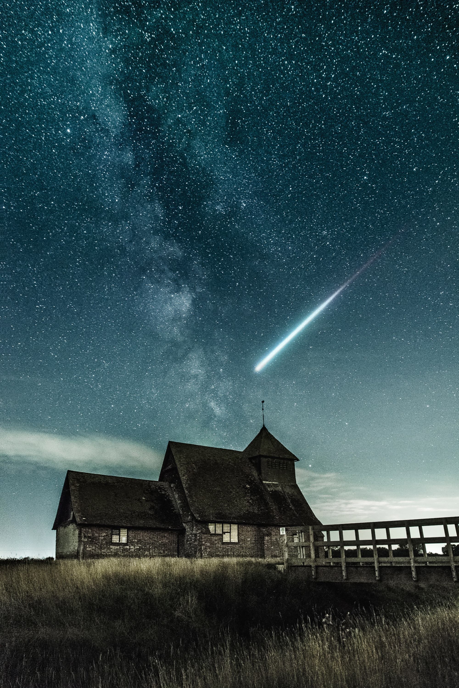
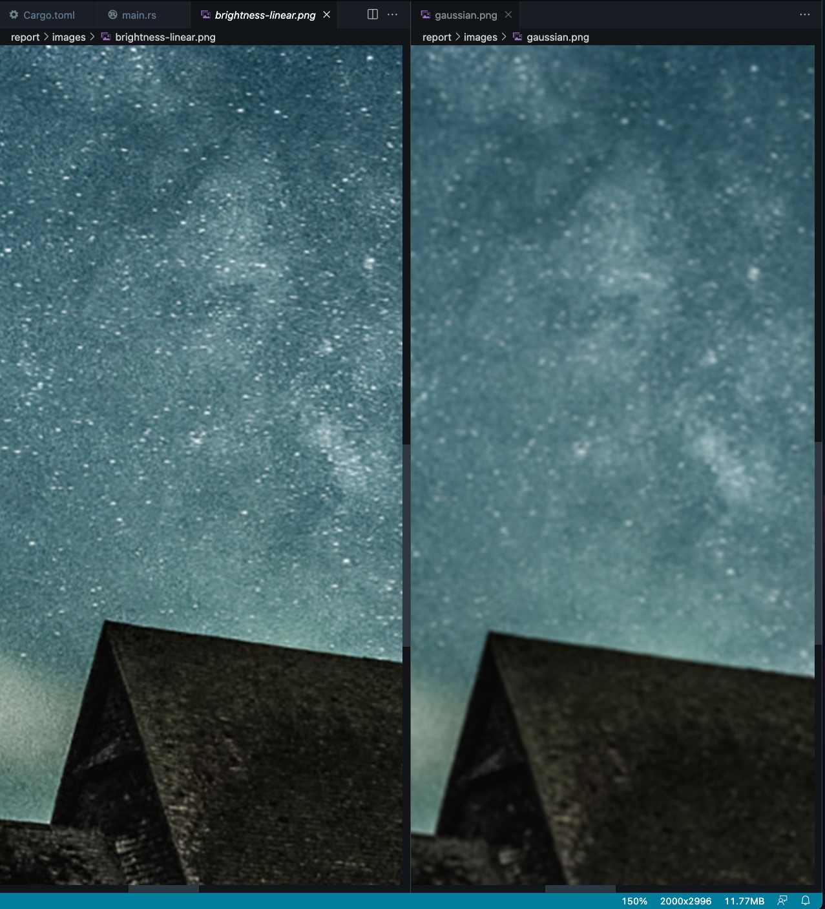
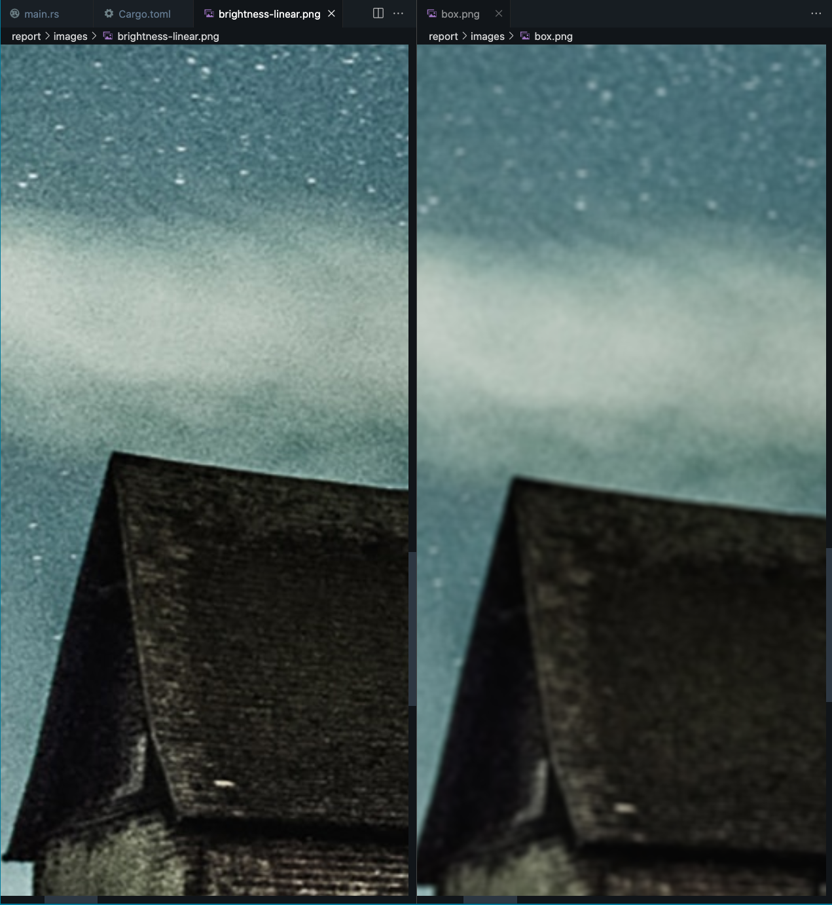

# lab1

Filters where applied to all channels of the image.

## source image

## linear brightness adjustment

The image has not changed at all because $H_{min}$ = 0.0$ and $H_{max} = 1.0$.

## exponetial brightness adjustment

## gaussian filter

Side-by-side comparsion with the original image:

## box filter

Side-by-side comparsion with the original image:

## unsharp masking

There are noticable artifacts when you look at the top of the image, but as far as I understand this is expected given how this algorithm works.

## edge detection with sobel operator

